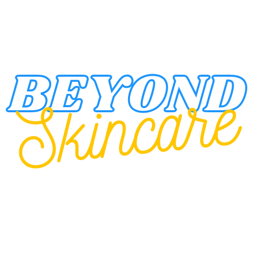

<div align="center">
  

  <h1>BEYOND Skincare — Design System</h1>

  <p>A modern, production-ready design system and component library built with React 18, TypeScript, Vite, and Tailwind CSS. Powers the BEYOND Skincare brand with a consistent visual language, accessible UI components, and a full interactive documentation hub.</p>

  <p>
    <a href="https://mariaelenacossio.github.io/DGL-309-design-system/" target="_blank">
      
    </a>
    &nbsp;
    
    &nbsp;
    
    &nbsp;
    
    &nbsp;
    
  </p>

  
</div>

---

## ✨ Highlights

- 🎨 **Comprehensive design token system** — colors, typography, spacing, and shadows all defined as structured tokens with light and dark variants
- 🌙 **Seamless dark / light mode** — OS preference detection, `localStorage` persistence, zero flash on load
- ♿ **WCAG 2.1 AA accessible** — `focus-visible` rings, `aria-*` attributes, `role="alert"/"status"`, skip-to-main link, and screen-reader-friendly semantics throughout
- 🧩 **Atomic component library** — 20+ components organized across atoms → molecules → organisms
- 📖 **Interactive documentation hub** — live component previews, color swatches with click-to-copy hex, type scale explorer, spacing visualizer, form playground, and navigation demos
- 💄 **BEYOND Skincare sample website** — a fully functional product showcase built entirely with the design system
- ⚡ **Vite 5 + HMR** — instant hot module replacement during development
- 🔒 **Strict TypeScript** — every component fully typed with `forwardRef`, `useId`, and proper HTML attribute extension

---

## 🚀 Live Site

**[→ View the Design System](https://mariaelenacossio.github.io/DGL-309-design-system/)**

The live site includes:
| Section | URL path |
|---|---|
| DS Home | `/` |
| Colors | `/design-system/colors` |
| Typography | `/design-system/typography` |
| Spacing | `/design-system/spacing` |
| Components | `/design-system/components` |
| Forms | `/design-system/forms` |
| Navigation | `/design-system/navigation` |
| BEYOND Website | `/website` |

---

## 🛠 Tech Stack

| Tool | Version | Purpose |
|---|---|---|
| React | 18 | UI rendering, hooks, StrictMode |
| TypeScript | 5 | Full static typing across all components |
| Vite | 5 | Build tool, HMR, path aliases |
| Tailwind CSS | 3 | Utility-first styling, design token integration |
| React Router | 6 | Client-side routing, nested layouts |
| Lucide React | latest | Icon library |
| clsx + tailwind-merge | latest | Safe conditional class composition via `cn()` |

---

## 🗂 Project Structure

```
├── img/                        # Brand assets and product photography
├── src/
│   ├── components/
│   │   ├── atoms/              # Button, Badge, Avatar, Input, Spinner, Typography, ThemeToggle
│   │   ├── molecules/          # Card, FormField, Alert, Modal
│   │   └── organisms/          # Navbar, Footer, Hero
│   ├── hooks/
│   │   └── useTheme.ts         # Dark/light mode with OS sync + localStorage
│   ├── pages/
│   │   ├── design-system/      # DS docs: Colors, Typography, Spacing, Components, Forms, Navigation
│   │   └── website/            # BEYOND Skincare sample site
│   ├── tokens/                 # colors.ts, typography.ts, spacing.ts, shadows.ts
│   ├── styles/
│   │   └── globals.css         # CSS custom properties for semantic tokens
│   └── utils/
│       └── cn.ts               # clsx + tailwind-merge utility
├── archive/                    # Original static HTML/CSS preserved for reference
├── public/img                  # Symlink → ../img (Vite static serving)
├── tailwind.config.ts
├── vite.config.ts
└── tsconfig.json
```

---

## 🎨 Design Tokens

### Color Scales
| Token | Value | Usage |
|---|---|---|
| `primary-600` | `#072ac8` | CTAs, focus rings, links |
| `secondary-500` | `#1e96fc` | Supporting accents |
| `accent-300` | `#a2d6f9` | Light backgrounds, chips |
| `cta-400` | `#fcf300` | Primary CTA buttons |
| `neutral-50` | `#fafbfc` | Light surface |
| `neutral-900` | `#111827` | Dark surface |

### Type Scale (15 steps)
```
display-lg → display-md → display-sm
heading-xl → heading-lg → heading-md → heading-sm → heading-xs
body-lg → body-md → body-sm → body-xs
label-lg → label-md → label-sm
```

### Spacing (4px base unit)
```
1 → 4px   |   4 → 16px   |   8 → 32px   |   16 → 64px   |   24 → 96px
```

---

## 🧩 Component Library

### Atoms
| Component | Variants / Notes |
|---|---|
| `Button` | 6 variants (primary, secondary, accent, ghost, danger, outline), 5 sizes, loading state, icon slots |
| `Badge` | 8 variants, 3 sizes, optional dot indicator |
| `Avatar` | Image or initials fallback, status indicator, 6 sizes |
| `Input` | Default / Filled / Flushed, error & success states, icon slots, `aria-invalid` |
| `Textarea` | Matches Input variants, auto-resize ready |
| `Select` | Matches Input variants, custom chevron |
| `Spinner` | 5 sizes, `role="status"` |
| `Typography` | `Heading`, `Text`, `Label`, `Code` with full scale props |
| `ThemeToggle` | Animated pill, Sun/Moon icons, calls `useTheme()` |

### Molecules
| Component | Variants / Notes |
|---|---|
| `Card` | 5 variants (default, elevated, outlined, filled, glass) + `ProductCard` |
| `FormField` | Render-prop pattern, `useId()`, `aria-live` error messages |
| `Checkbox` | Indeterminate state, `aria-checked` |
| `RadioGroup` / `RadioOption` | Accessible grouping with `role="radiogroup"` |
| `Alert` | 4 variants, `role="alert"` (warning/danger) / `role="status"` (info/success), dismissible |
| `Modal` | Native `<dialog>`, `showModal()`, backdrop-click dismissal, `aria-labelledby` / `aria-describedby` |

### Organisms
| Component | Notes |
|---|---|
| `Navbar` | Responsive, theme toggle, BEYOND logo, mobile hamburger |
| `DSSidebar` | Documentation nav with section groups |
| `Footer` | Brand block, links, copyright |
| `DSHero` | Full-bleed gradient hero for DS pages |
| `WebsiteHero` | Product hero with image prop |

---

## 💻 Usage Examples

### Button
```tsx
import { Button } from '@/components/atoms/Button'

<Button variant="primary" size="md" iconRight={<ArrowRight />}>
  Explore Components
</Button>

<Button variant="cta" loading={isSubmitting}>
  Add to Cart
</Button>
```

### Card
```tsx
import { Card, CardHeader, CardContent, ProductCard } from '@/components/molecules/Card'

<Card variant="elevated">
  <CardHeader title="Niacinamide Booster" subtitle="Brightening serum" />
  <CardContent>...</CardContent>
</Card>

<ProductCard
  title="Rosehip Face Oil"
  price="$38"
  image="/img/product-4.jpg"
  badge="Bestseller"
/>
```

### FormField with validation
```tsx
import { FormField } from '@/components/molecules/FormField'
import { Input } from '@/components/atoms/Input'

<FormField label="Email" error={errors.email} required>
  {(id, hasError) => (
    <Input
      id={id}
      type="email"
      aria-invalid={hasError}
      placeholder="hello@beyond.com"
    />
  )}
</FormField>
```

### Alert
```tsx
import { Alert } from '@/components/molecules/Alert'

<Alert variant="success" onDismiss={() => setVisible(false)}>
  Your routine has been saved!
</Alert>
```

### Dark / Light Mode
```tsx
import { useTheme } from '@/hooks/useTheme'

const { theme, toggle, isDark } = useTheme()
// Reads localStorage → falls back to OS prefers-color-scheme
// Toggles .dark class on <html>
```

---

## ♿ Accessibility

- All interactive elements support **keyboard navigation** with `focus-visible:` rings
- Color contrast meets **WCAG 2.1 AA** across light and dark modes
- Form inputs use `aria-invalid`, `aria-describedby`, and `aria-live` for error announcements
- Icons are `aria-hidden="true"` when decorative; labeled when standalone
- Modal traps focus via native `<dialog>` with `showModal()`
- Skip-to-main link on every page layout

---

## 🏃 Getting Started

```bash
# Clone
git clone https://github.com/mariaelenacossio/DGL-309-design-system.git
cd DGL-309-design-system

# Install dependencies
npm install

# Start dev server (localhost:5173)
npm run dev

# Production build
npm run build
```

---

## 📸 Screenshots

> Visit the **[Live Site](https://mariaelenacossio.github.io/DGL-309-design-system/)** for full interactive previews of the design system docs and BEYOND Skincare website.

---

## 📋 Changelog

### v2.0.0
- Full migration from static HTML/CSS to React 18 + TypeScript + Vite + Tailwind CSS
- Design token system (colors, typography, spacing, shadows)
- 20+ accessible components across atomic design hierarchy
- Interactive documentation hub with 7 pages
- BEYOND Skincare website rebuilt on the design system
- Dark / light mode with OS sync
- BEYOND Skincare branding throughout (logo, local images, color palette)

### v1.0.0
- Original static HTML/CSS design system (archived in `/archive`)

---

<div align="center">
  
  <br />
  <sub>Designed & built by <strong>Maria Elena Cossio Clark</strong></sub>
</div>
